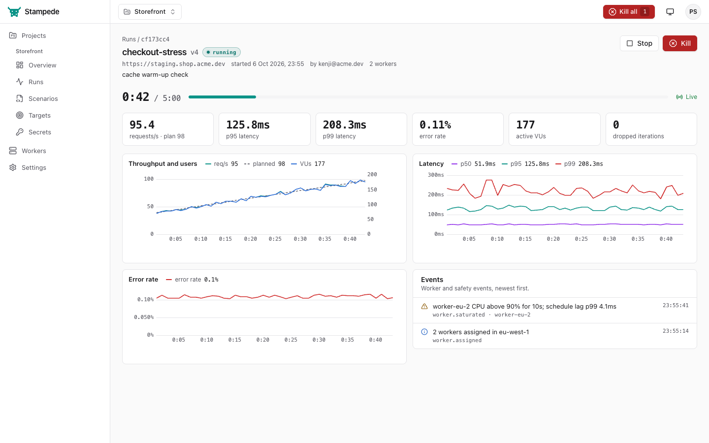

# Stampede web UI

The browser UI for a Stampede server: projects, targets, secrets, versioned
scenarios with a schema-aware YAML editor, runs with live charts, reports,
workers and settings. It talks only to the public REST API in
[`../api/openapi.yaml`](../api/openapi.yaml).



More screenshots (light and dark) are in [`docs/screenshots`](docs/screenshots).

## Stack

React 18, TypeScript (strict), Vite, TanStack Router and Query, Tailwind CSS
with Radix UI primitives, uPlot (live charts), Apache ECharts (report charts),
Monaco with monaco-yaml (bound to [`../schema/scenario.schema.json`](../schema/scenario.schema.json)),
React Flow (journey graph). The API client is generated from the OpenAPI spec
with `openapi-typescript` and called through `openapi-fetch`.

Nothing is loaded from the network at runtime: fonts are system fonts and
Monaco, its workers and every chart library are bundled, so the UI works
air-gapped.

## Develop

Requires Node 22+ and pnpm 10.

```sh
pnpm install
pnpm dev          # http://localhost:5173, proxies /api to http://localhost:8080
pnpm dev:mock     # no server needed: MSW serves realistic fixture data
```

Set `STAMPEDE_API=http://host:port` to proxy to another server.

In mock mode you are signed in as the owner of "Acme Retail" with three
projects, a run in progress (streamed over SSE), run history with reports,
workers, users, tokens and an audit log. Starting a run creates a new
simulated run that finishes on its planned duration (use a short `duration`
override to see the switch to the report). URL switches:

| URL                      | Shows                                                           |
| ------------------------ | --------------------------------------------------------------- |
| `/?mock=setup`           | the first-run setup screen                                      |
| `/login?mock=signed-out` | the sign-in screen (`priya@acme.dev` / `correct-horse-battery`) |
| `/?mock=viewer`          | the UI as a read-only viewer                                    |

The mock fixtures are typed with the generated OpenAPI types, so they fail to
compile if they drift from the spec. The same handlers back the tests.

## Scripts

| Script           | Does                                                              |
| ---------------- | ----------------------------------------------------------------- |
| `pnpm generate`  | regenerate `src/api/schema.gen.ts` from `../api/openapi.yaml`     |
| `pnpm typecheck` | `tsc -b`                                                          |
| `pnpm lint`      | ESLint (typescript-eslint strict, react-hooks) and Prettier check |
| `pnpm format`    | Prettier write                                                    |
| `pnpm test`      | Vitest + Testing Library (jsdom)                                  |
| `pnpm build`     | type-check and build to `dist/`                                   |

Run `pnpm generate` whenever the OpenAPI spec changes, and commit the result.

## The built UI is committed

`dist/` is committed (the repository root ignores `web/dist/`; `web/.gitignore`
re-includes it) and embedded by [`embed.go`](embed.go):

```go
import "github.com/Ivan825/Stampede/web"
// web.Dist is an embed.FS rooted at "dist"
```

Why commit build output: `go install github.com/Ivan825/Stampede/cmd/stampede@latest`
and plain `go build` cannot run pnpm, and the product is a single binary, so
the UI has to be in the module. To keep the repository from growing with every
UI change, vendor code is split into content-hashed chunks (`monaco`, `echarts`,
`flow`, `uplot`, `yaml`, `vendor`, plus Vite's preload helper in `runtime`)
that never import app code, so they only change when dependencies change; an
ordinary UI change rewrites a few small app chunks (tens of KB). The build is
reproducible: building the same sources twice gives byte-identical files.

**After changing anything under `src/`, run `pnpm build` and commit `dist/`
with the change.** A CI check that `dist/` is up to date is a good follow-up.

Build size (Vite 8, minified): about 6.4 MB on disk, most of it Monaco
(3.6 MB, 0.9 MB gzipped) and its YAML worker (1 MB), which load only on the
scenario editor. The first page needs about 450 KB (140 KB gzipped): the app
entry, the React/Router/Query/Radix vendor chunk and CSS. ECharts (550 KB)
loads with run pages.

## Layout

```
src/
  api/        generated schema, typed client (CSRF header, ApiError), query hooks
  app/        shell, kill switch, route errors
  components/ UI primitives, chips, dialogs, toasts, theme
  features/   runs (live view, report, new-run dialog), scenarios (editor, graph)
  lib/        formatting (mirrors internal/report), roles, SSE hook, Monaco setup
  mocks/      MSW handlers, in-memory store and simulated runs
  pages/      one file per route
  test/       test setup, MSW server, render helpers
```

## Conventions

- Latency comes from the API in seconds and is shown like the Go report
  (`ms()` in `src/lib/format.ts` mirrors `report.Ms`). Numbers use tabular
  monospace.
- Status and verdict colours are consistent everywhere: pass green, fail red,
  generator-limited amber.
- Role-aware: actions the signed-in role cannot perform are hidden or
  disabled (runner starts runs; editor edits scenarios, targets and secrets;
  admin manages users and sees the audit log). The server enforces the same
  rules.
- Errors show the API's `message` and every `details` line.
